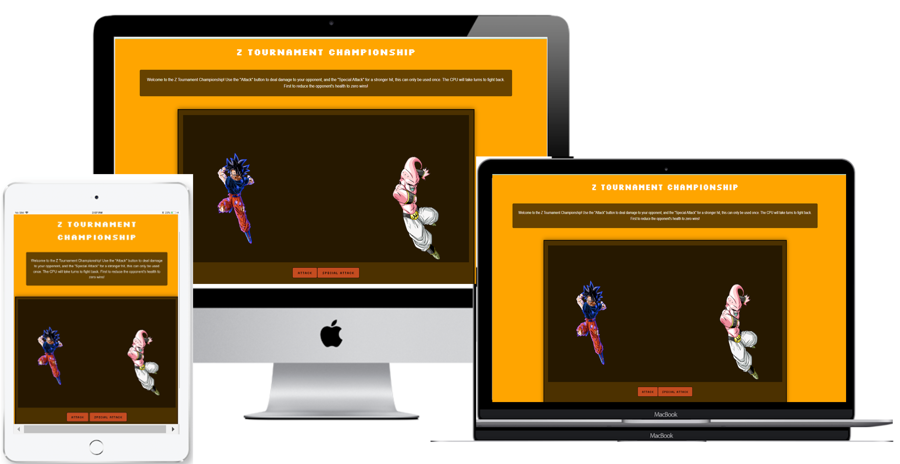
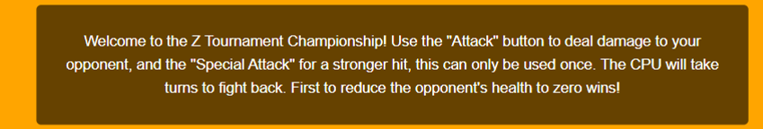
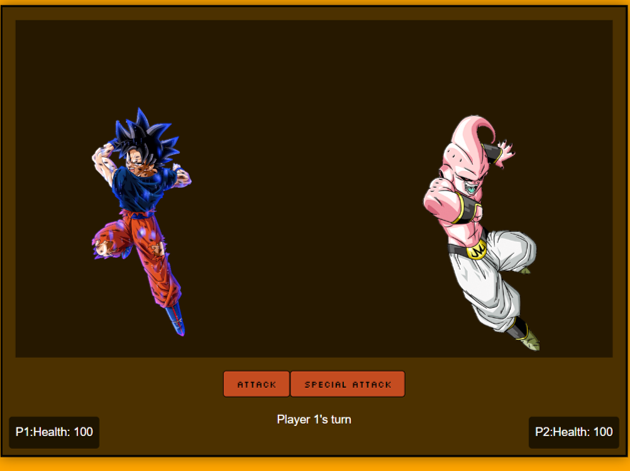
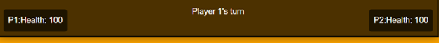
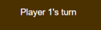

# Z Tournament Championship
## Overview
Z Tournament Championship is a retro Dragon Ball Z inspired game packed full of nostalgia. As a child DBZ was my favourite show and it continued to be as i grew older, i wanted to pay tribute to that with this project!

Z tournament championship is an interactive web-based fighting game that showcases the power of JavaScript in creating a dynamic and engaging user experiences. This project aims to offer players an enjoyable and nostalgic game, where they can engage in one-on-one combat using iconic characters. The target audience includes fans of fighting games, anime enthusiasts, and those with an interest in game development. By offering both basic attacks and special moves, Z Tournament Championship provides a game where players can time the use of their attacks to gain victory. This game is fully responsive, ensuring a seamless experience across a wide range of devices, from desktops to mobile phones.

## Features
Z Tournament Championship has many features to enhance the gameplay experience and provide users with clear feedback and control options. Each feature is designed to improve user engagement and deliver a polished, enjoyable gaming experience.

## Existing Features
### The Z Tournament Heading
Featured at the top of the page is the heading, the Z Tournament Championship heading immediately capture the user's attention adn gives the nostalgic retro feel that is displayed throughout the page. This ensures that users are aware of the game's identity from the moment they land on the page, using an arcade like theme from google fonts gives the correct impression for the purpose of the game. 

## Instructions 
To allow for a seamless user experince below the heading players are greeted with clear instructions on how to play the game. It outlines the basic controls, game mechanics, and the objective of the game. This ensures that players can easily understand how to engage with the game, enhancing user satisfaction.

## The Game Area
The main area where the game takes place, featuring two characters, Goku and Majin Buu, facing off against each other. The game area is designed with dynamic backgrounds and responsive character animations including real-time visual feedback on attacks and damage dealt. this gives a better user experince allow users to better undertsand what is happening during the fight.

## Game Controls
Includes the "Attack" and "Special Attack" buttons, allowing players to execute different types of moves against their opponents. This gives players control over their character's actions, allowing for strategic gameplay decisions that can influence the outcome of the match.

## Health Displays
The health displays are positioned below each character, showing their current health level. As damage is taken, the health decreases, providing a visual represenation of their health. This allows users to keep track of their health through the game and make decisons on which attack to use dpeending on their remainign health.

## Game Information Display
A dynamic text area that updates to inform players of the current turn, attack outcomes, and game progress. This helps keep players informed and engaged by providing real-time updates and feedback on their actions and the game.

## Restart Button
At the end of the game when a winner is decalred the restart button will appear, allowing players to quickly restart the game without needing to refresh the page. This enhances the user experience by making it easy to replay the game, encouraging continued engagement and multiple playthroughs.

## Features Left to Implement

### Multiplayer Mode
Future plans include adding a multiplayer mode where players can compete against each other in real-time. This expands the game's appeal by allowing friends to play together, increasing the game's replay value.

### Character Selection
Adding a roster of characters from the DBZ universe that can be selected by the user. Users will be able to select their favourite characters catering the game to them. This allows the game to be more customisable adding more variety and depth to the game.

### interchangeable packgrounds and theme music
Including chnageable packgrounds and theme music would give the game more of an arcade feel and once again give users more options enhancing the user experience.

### Enhanced animations and specific special attacks per character
In future versions the player animations when attacking would be improved and animations for attacks would be visible showing the energy being shot from one character at the other. Another feature that would be included would be giving each charcter their own special attack from the anime series and the corresponding animation. this improves the game mehcanics and the visual and gaming experience for the user.

### Adding levels of increasing difficulty 
As the users go through the game, if they were to win the first match then a new opponent would be loaded for 'level 2' this opponent would be stronger and have different attacks. This adds variety and gives users somethig to play for as they can progress through the game, increasing the replay value.

## Testing
Thorough testing has been conducted to ensure that Z Tournament Championship functions as intended across all supported devices and browsers. Each feature has been rigorously tested to confirm that it works as expected, providing a smooth and enjoyable user experience.

### Cross-Browser Testing
Browsers Tested: Google Chrome, Mozilla Firefox, Safari, Microsoft Edge
The game performs consistently across all tested browsers, with no noticeable differences in functionality or appearance.

### Responsive Design Testing
Devices Tested: Desktop, Tablet, Mobile.
The game is fully responsive, with all elements adapting appropriately to different screen sizes. No major issues were encountered during testing on various devices.

### Validator Testing

HTML
Results: No errors were returned when passing through the official W3C validator.
CSS
Results: No errors were found when passing through the official (Jigsaw) validator.
JavaScript
Results: No errors were found when passing through the official JSHint validator. The following metrics were returned:
There are 15 functions in this file.
The function with the largest signature takes 2 arguments, while the median is 0.
The largest function has 12 statements in it, while the median is 3.
The most complex function has a cyclomatic complexity value of 4 while the median is 2.

## Unfixed Bugs
Special Attack Button Visibility: Occasionally, after restarting the game, the special attack button may not reappear as expected. This issue has been identified but remains unresolved due to time constraints. Further investigation is required to implement a reliable fix.
Deployment
Z Tournament Championship has been deployed to GitHub Pages, providing an easy way for users to access and play the game online. The deployment process was straightforward, and the site is now live and accessible via the following steps:

Navigate to the GitHub Repository: Go to the repository where the project's code is stored.
Access the Settings Tab: Click on the "Settings" tab in the repository's menu.
Choose the Source Branch: In the "Pages" section, select "Main" or "Master" branch as the source.
Save and Deploy: After selecting the branch, the site will automatically deploy. A success message will appear once the process is complete.
The live link to the deployed site is available here: Z Tournament Championship Live

Credits
Content
Game Logic and JavaScript Implementation: Developed and written by [Your Name].
Instructional Text: Created specifically for Z Tournament Championship.
Media
Character Images: The character images used in the game are sourced from [specific open-source sites or created by the developer].
Icons and Buttons: Icons and buttons are styled using custom CSS, with inspiration drawn from various online resources.
Acknowledgments
Tutorials and Guides: Special thanks to the authors of various JavaScript and CSS tutorials that helped refine the game's functionality.
Testing Assistance: Acknowledgment to friends and peers who assisted in testing the game across different platforms and providing valuable feedback